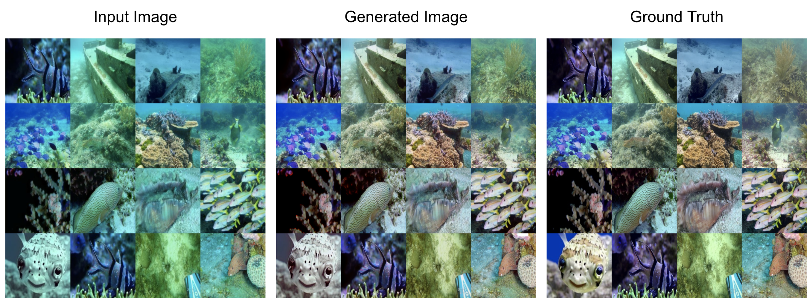

# FUnIE-GAN-PyTorch

PyTorch implementations of the [paper](https://arxiv.org/pdf/1903.09766.pdf).

## Tasks

- [x] Data preprocessing
- [x] FUnIE-GAN-V1 architecture trained using paired data
- [x] FUnIE-GAN-V2 architecture trained using paired data
- [x] FUnIE-GAN-UP architecture trained using unpaired data
- [x] Official evaluation
- [x] Provide model weights

## Installation

```shell
pip install --no-cache-dir -r requirements.txt
```

## Data Preprocessing

Please refer to [here](https://github.com/rowantseng/FUnIE-GAN-PyTorch/tree/master/preprocess) to prepare the paired and unpaired dataset.

## Model Architecture

The network architecture `FUnIE-GAN` is tackled with paired dataset training. On the other hand, `FUnIE-GAN-UP` is designed for the unpaired data.

### FUnIE-GAN

`FUnIE-GAN` includes a generator and a discriminator. In the official implementation, there are two versions of `FUnIE-GAN`, [v1](https://github.com/xahidbuffon/FUnIE-GAN/blob/8f934c834c94e007b00866186b9ee624dc2b7b69/TF-Keras/nets/funieGAN.py#L92) and [v2](https://github.com/xahidbuffon/FUnIE-GAN/blob/8f934c834c94e007b00866186b9ee624dc2b7b69/TF-Keras/nets/funieGAN.py#L133). In `FUnIE-GAN-V1`, the generator has five encoder-decoder blocks with skip connections. The discriminator has four convolutional blocks. `FUnIE-GAN-V1` downsamples the feature using strided convolutions. In this PyTorch work, I have some slight changes for the easier play. They are indicated in the comments.


However, `FUnIE-GAN-V2` adopts different strategy to downsample the features(conv+pooling). There are six encoder-decoder blocks with skip connections. The discriminator is same as `FUnIE-GAN-V1`.

### FUnIE-GAN-UP

`FUnIE-GAN-UP` has a pair of generators and a pair of discrimators. The objective is to learn the mapping X -> Y and the reconstruction Y -> X simultaneously by maintaining cycle-consistency. The generator also retains the encoder-decoder structure. Furthermore, addtional convolutional layers and residual blocks are inserted as the bridge to extract more complex features. Finally. the discriminator is built using convolutional blocks.

## Training 

### Paired Training

During training, three sets(`underwater_imagenet`, `underwater_dark`, and `underwater_scenes`) of images are separated. The provided model weights are trained using the same hyper-parameter settings. The training statistics are saved to `--save-path` including checkpoints, best models, and enhanced examples. `-d` is specified the source path. `--epochs`, `--lr`, `-b`, and `-j` are the total number of epochs, learning rate, batch size, and the total number of workers for preparing the dataset.

For paired traing, there are two versions of architectures, `FUnIE-GAN-V1` and `FUnIE-GAN-V2`. `-a` is specified for the model architecture. 

```shell
# For arch="v1", the batch size is set at 16
python train.py \
--save-path "/path/to/save/model" \
-d "/path/to/underwater_imagenet" \
-a "v1" --epochs 100 --lr 1e-4 -b 16 -j 8

# For arch="v2", the batch size is set at 8
python train.py \
--save-path "/path/to/save/model" \
-d "/path/to/underwater_imagenet" \
-a "v2" --epochs 100 --lr 1e-4 -b 8 -j 8
```

You can resume training by specifying the path to the generator(`--gen-resume`) and the path to the discriminator(`--dis-resume`).

```shell
python train.py \
--save-path "/path/to/save/model" \
-d "/path/to/underwater_imagenet" \
--gen-resume "/path/to/saved/generator" \
--dis-resume "/path/to/saved/discriminator" \
-a "v1" --epochs 100 --lr 1e-4 -b 16 -j 8
```

### Unpaired Training

For unpaired traing, the model architecture is fixed.

```shell
python train_unpair.py \
--save-path "/path/to/save/model" \
-d "/path/to/unpair/data" \
--epochs 40 --lr 1e-4 -b 16 -j 12
```

The training can be resumed by specifying the paths to generators and discriminators(`--gen-dstd2ehcd-resume`, `--gen-ehcd2dstd-resume`, `--dis-dstd-resume`, and `--dis-ehcd-resume`).

## Evaluation: SSIM, PSNR, UIQM

Enhanced images are predicted using `infer.py`. Model trained by paired data or unpaired data can be executed by the same inference script.

```shell
python infer.py \
--save-path "/path/to/save/generated/images" \
-d "/path/to/EUVP/test_samples/Inp" \
-m "/path/to/generator" \
-b 16 -j 8
```

The metrics are calculated using the official evaluation. Please refer to [here](https://github.com/rowantseng/FUnIE-GAN-PyTorch/tree/master/evaluation).

```shell
cd evaluation

# Run UIQM measurement
python measure_uiqm.py \
--data "/path/to/EUVP/generated/images"

# Run SSIM and PSNR measurement
python measure_ssim_psnr.py \
--image-data "/path/to/EUVP/generated/images" \
--label-data "/path/to/EUVP/test_samples/GTr"
```

## Visualization

The visualization is represented in the [slide](https://docs.google.com/presentation/d/1pqlNFPTQu6y_MTapsG_b8kRQIPAu_F0-gAYV7qvo078/edit?usp=sharing). 



As above, the result is trained on paired dataset `underwater_scenes` using `FUnIE-GAN-V2` architecture, which has the best performance of SSIM, PSNR, and UIQM(see [evaluation](https://github.com/rowantseng/FUnIE-GAN-PyTorch/tree/master/evaluation)).

## Citing FUnIE-GAN

```
@article{islam2019fast,
     title={Fast Underwater Image Enhancement for Improved Visual Perception},
     author={Islam, Md Jahidul and Xia, Youya and Sattar, Junaed},
     journal={IEEE Robotics and Automation Letters (RA-L)},
     volume={5},
     number={2},
     pages={3227--3234},
     year={2020},
     publisher={IEEE}
 }
```

## License

The code is released under the [MIT license](https://github.com/rowantseng/FUnIE-GAN-PyTorch/blob/master/LICENSE).